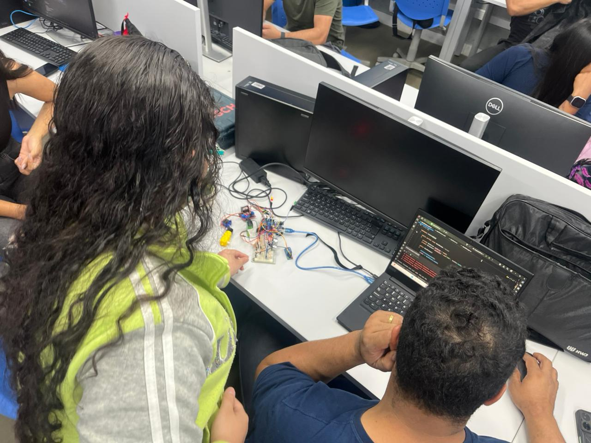

<h1 align="center"> Documentação Smart Factory: OPC-Systems   Software House industrial. </h1>

 
  
   

<h3> Equipe responsável:   Marilene Araujo e Vinícius </h3>
<h3> Instrutor: Frederico Martins Aguiar </h3>

<h2 align="center"> Introdução </h2>

A empresa SmartFactory OPC Systems está desenvolvendo uma solução para monitoramento e controle de uma planta piloto, utilizando o protocolo OPC UA como meio de comunicação entre dispositivos fisicos e aplicações desktop.  
O cliente solicitou que a aplicação seja capaz de:

- Coletar dados de sensores conectados a um Arduino (via Serial).
- Publicar os dados coletados em um Servidor OPC UA.
- Criar Clientes WPF independentes para cada grandeza medida.
- Permitir o acionamento remoto de dispositivos (motor, relé, servo).
- Versionar toda a documentação e o código no GitHub  

A turma deverá atuar como uma equipe única de desenvolvimento, simulando uma software house industrial dividida em squads de responsabilidade.

<h2 align="center"> Responsabilidades das Squads </h2>

<h2> Squad 1: Documentação e Testes </h2>

  Squad composto pelos membros: <b>Marilene Araujo e Vinícius Gomes.</b>  
  Esta Squad garante a qualidade, rastreabilidade e manutenibilidade de todo o projeto.  

- Elaborar e manter toda a documentação técnica do projeto, incluindo:
    - Estrutura e arquitetura geral do sistema OPC UA.
    - Diagrama de blocos e fluxos de dados entre os módulos.      
,   - Configuração e uso das aplicações (Servidor, Clientes e Arduino).
- Criar e gerenciar o repositório GitHub da turma, garantindo versionamento adequado do código e da documentação.
- Definir e aplicar planos de teste funcionais e de integração:
  - Testar a comunicação Serial (Arduino ↔ Servidor).
  - Testar a comunicação OPC UA (Servidor ↔ Clientes).
  - Validar as funcionalidades de controle remoto (acionamento de motor, relé, servo).
- Registrar bugs, ajustes e melhorias necessárias.

<b> Dificuldades </b>
- Organização das informações coletadas;
- Planejamento no recebimento das informações.
- Controle da execução das squads.

<h2> Squad 2: Arduino (Coleta de Dados) & Servidor OPC UA </h2>

 
  Squad composto pelos membros: <b> Alice Virginia, Danilo Santos, Luna Beatriz, Otávio Soares.</b>  
  Este squad é o responsável pela coleta de dados no nível do hardware e pela comunicação middleware, formando a base da arquitetura Cliente-Servidor do OPC UA.   

- Desenvolver o Servidor OPC UA responsável por:
  - Coletar dados dos sensores conectados ao Arduino via porta Serial.
  - Converter e publicar esses dados como nós (nodes) OPC UA acessíveis aos clientes.
- Programar o Arduino para:
    - Ler sensores (temperatura, umidade, ultrassônico, infravermelho, etc.).
    - Controlar atuadores (motor, relé, servo).
    - Enviar os dados via Serial no formato adequado.
- Implementar o mapeamento entre variáveis físicas e variáveis OPC UA, garantindo atualização contínua e confiável dos dados.
- Garantir que o servidor aceite comandos OPC UA vindos dos clientes para acionar os atuadores remotamente.

<b> Pontos Importantes </b>
- As ligações positivo e negativo (5V e GND) identificadas em vermelho e preto para padronização

<b> Dificuldades </b>
- Montagem e ligação dos sensores a protoboard/arduino sendo posição correta de conexão do sensor

<h3 align="center"> Esquema de Montagem do Aduino </h3>

DIAGRAMA

<h3 align="center"> Montagem Protótipo </h3>

  

<h3 align="center"> Código do Arduino Versão Inicial - V.1.0 </h3>

 Imagem 

<h3 align="center"> Código do Arduino Versão Final - V.2.0 </h3>

 Imagem 

<h2> Squad 3: Clientes OPC UA </h2>

  Squad composto pelos membros: <b>Diulie Batista, Yhan, Nicolas Oliveira, Bruno Maia.</b>  
  Este Squad tem a responsabilidade de desenvolver as aplicações Cliente WPF (desktop) independentes, que se conectam ao Servidor OPC UA, oferecendo visualização em tempo real dos sensores e permitindo o envio de comandos remotos de controle para os atuadores.  
  

- Criar aplicações clientes WPF independentes para cada grandeza medida (por exemplo, um cliente para temperatura, outro para umidade, etc.).
- Implementar a interface gráfica (UI) para visualização dos dados em tempo real.
- Garantir que cada cliente consiga ler e escrever dados no servidor OPC UA (monitorar e também enviar comandos).
- Desenvolver recursos de controle remoto para dispositivos (acionamento de motor, servo, relé) via OPC UA.
- Realizar testes de desempenho e confiabilidade na comunicação cliente-servidor.

<h3 align="center"> Interface WPF Client </h3>

 
  Idealização da primeira interface: < 
  imagem

 
  Segunda interface mais intuitiva:  
  imagem

 
 Tela com erro o a ser solucionado:  
  DESCRIÇÃO DO ERRO.  
  imagem 

 Interface atual após a correção dos erros.  
 imagem

<h2> Squad 4: Gêmeo Digital </h2>

  Squad composto pelos membros: <b>Lucas Aquino, Miguel Duarte, Erick.</b>  
  Este Squad tem a responsabilidade de desenvolver as aplicações desktop independentes, essenciais para a visualização e controle de cada variável.  

- Desenvolver um gêmeo digital (representação virtual da planta piloto), que reproduza em tempo real o comportamento dos sensores e atuadores.

- Criar uma interface 3D ou painel gráfico dinâmico que mostre:

  - Variação dos sensores.

  - Estado dos atuadores (ligado/desligado, posição, etc.).

- Integrar o gêmeo digital ao Servidor OPC UA para sincronizar dados reais e simulados.

- Implementar um modo de simulação offline, permitindo testar o sistema mesmo sem hardware físico.

- Colaborar com o grupo de clientes OPC UA para validar a atualização visual e interativa do ambiente virtual.
